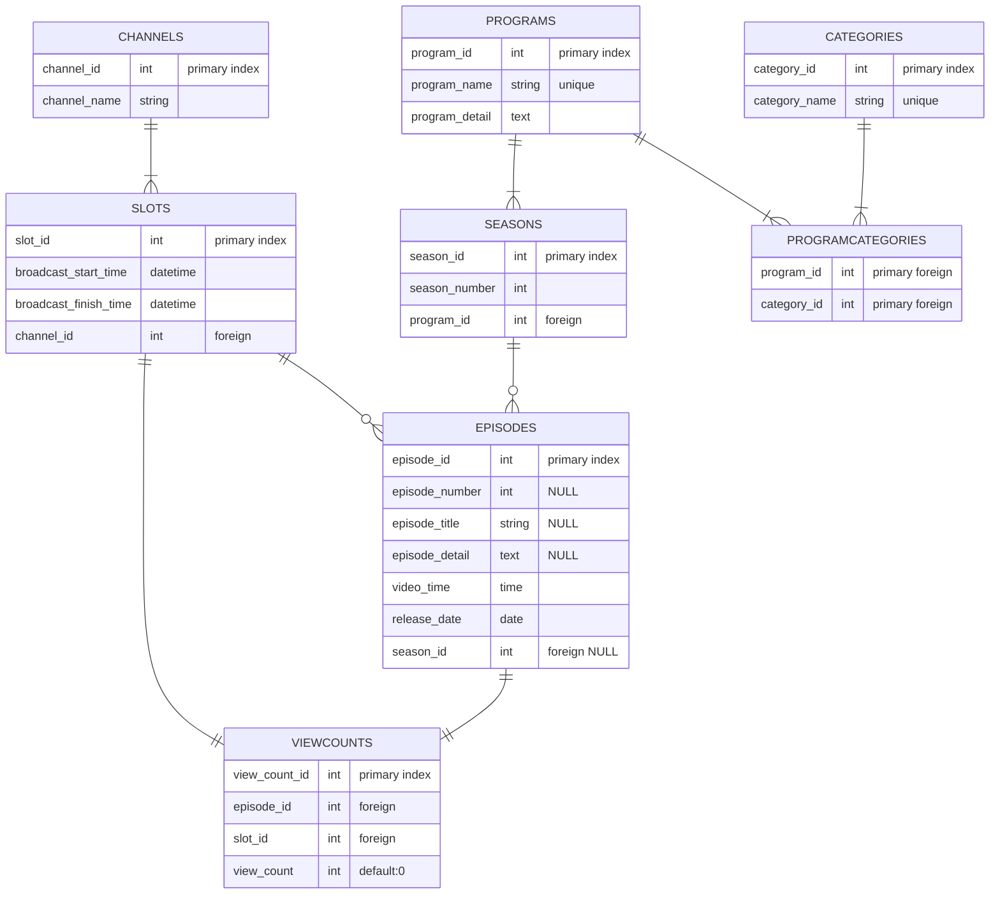

# 記録用

# メモ
* チャンネルは複数
* 各チャンネルは時間帯毎の番組枠を持つ
* 番組枠1つに対して1つの番組が入る
* エピソードは最小単位としての番組、そのため番組枠が持つのはエピソード
* エピソードはシーズン数、エピソード数、タイトル、エピソード詳細、動画時間、公開日、視聴数をもつ
* エピソードは自分が所属するシーズンを参照する
* `series_id'と'program_id'はどちらかしか持たない
