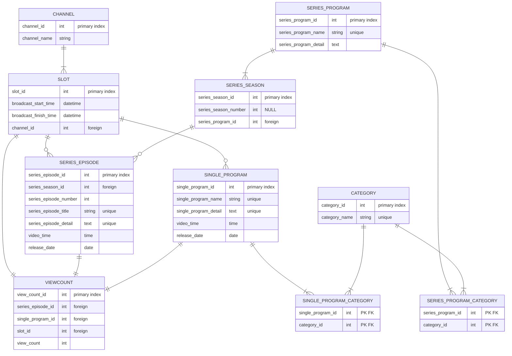

# メイン

```mermaid

erDiagram
 CHANNEL ||--|{ SLOT : ""
 SLOT ||--o{ SERIES_EPISODE : ""
 SLOT ||--o{ SINGLE_PROGRAM : ""
 SERIES_PROGRAM ||--|{ SERIES_SEASON : ""
 SERIES_SEASON ||--o{ SERIES_EPISODE : ""
 SERIES_PROGRAM ||--|{ SERIES_PROGRAM_CATEGORY : ""
 SINGLE_PROGRAM ||--|{ SINGLE_PROGRAM_CATEGORY : ""
 CATEGORY ||--|{ SERIES_PROGRAM_CATEGORY : ""
 CATEGORY ||--|{ SINGLE_PROGRAM_CATEGORY : ""
 SLOT ||--|| VIEWCOUNT : ""
 SERIES_EPISODE ||--|| VIEWCOUNT : ""
 SINGLE_PROGRAM ||--|| VIEWCOUNT : ""

 CHANNEL {
 channel_id int "primary index"
 channel_name string 
 }

 SLOT {
 slot_id int "primary index"
 broadcast_start_time datetime
 broadcast_finish_time datetime
 channel_id int "foreign"
 }
 SERIES_PROGRAM {
 series_program_id int "primary index"
 series_program_name string "unique"
 series_program_detail text
 }
 SERIES_SEASON {
 series_season_id int "primary index"
 series_season_number int "NULL"
 series_program_id int "foreign"
 }
 SERIES_EPISODE {
 series_episode_id int "primary index"
 series_season_id int "foreign"
 series_episode_number int
 series_episode_title string "unique"
 series_episode_detail text "unique"
 video_time time
 release_date date
 }
 SINGLE_PROGRAM {
 single_program_id int "primary index"
 single_program_name string "unique"
 single_program_detail text "unique"
 video_time time
 release_date date
 }
 VIEWCOUNT {
 view_count_id int "primary index"
 series_episode_id int "foreign"
 single_program_id int "foreign"
 slot_id int "foreign"
 view_count int
 }
 CATEGORY {
 category_id int "primary index"
 category_name string "unique"
 }
 
 SERIES_PROGRAM_CATEGORY {
 series_program_id int "PK FK"
 category_id int "PK FK"
 }

 SINGLE_PROGRAM_CATEGORY {
 single_program_id int "PK FK"
 category_id int "PK FK"
 }


```

